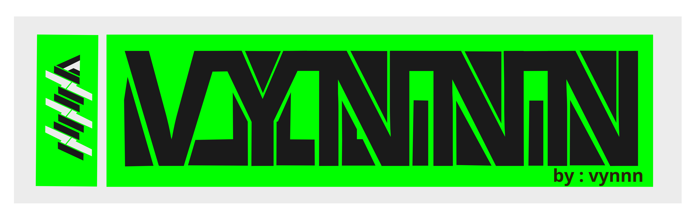

<h3 align="center" > اِقْرَأْ بِاسْمِ رَبِّكَ الَّذِيْ خَلَقَۚ </h3>
<h3 align="center"style="font-family: orbitron;">MAHASISWA TEKNIK </h3>

<h3 align="center"font-family: style="font-family: orbitron;">"Stop looking at others.  Focus on yourself.  And walk the path of your destiny.   Others cannot block your path of destiny.  And you also cannot live the destiny of others."   berhentilah melihat orang lain   fokus pada dirimu   dan berjalanlah di jalan takdir dirimu  orang lain tak dapat menghalangi jalan takdirmu   dan kamu juga tak dapat menjalani takdir orang lain</h3>
<h1 align="center"style="font-family: orbitron;">Hi 👋, I'm  vynxidn</h1>
<h1 align="center">from INDONESIA</h1>

  

<h3 align="left">Connect with me:</h3>

<a href="https://instagram.com/vynxidn" target="blank">ig: vynxidn</a>

<!--
**vynxidnIsHumanAndUHumans/vynxidnIsHumanAndUHumans** is a ✨ _special_ ✨ repository because its `README.md` (this file) appears on your GitHub profile.

Here are some ideas to get you started:

- 🔭 I’m currently working on ...
- 🌱 I’m currently learning ...
- 👯 I’m looking to collaborate on ...
- 🤔 I’m looking for help with ...
- 💬 Ask me about ...
- 📫 How to reach me: ...
- 😄 Pronouns: ...
- ⚡ Fun fact: ...
-->
